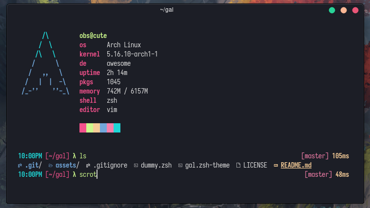

# gal

gal is a minimalst zsh theme intended primarly for personal use. based on [gallois](https://github.com/ohmyzsh/ohmyzsh/blob/master/themes/gallois.zsh-theme).



## Installation

### [zinit](https://github.com/zdharma-continuum/zinit)

```sh
zinit ice wait'!0'
zinit light fawni/gal
```

_in `.zshrc`_

### [antigen](https://github.com/zsh-users/antigen)

```sh
antigen theme fawni/gal gal
```

_in `.zshrc`_

### [oh-my-zsh](https://github.com/ohmyzsh/ohmyzsh)

clone repo

```sh
git clone https://github.com/fawni/gal
```

symlink theme file

```sh
ln -s gal/gal.zsh-theme ~/.ohmyzsh/themes/
```

set the theme in `.zshrc`

```sh
ZSH_THEME="gal"
```
